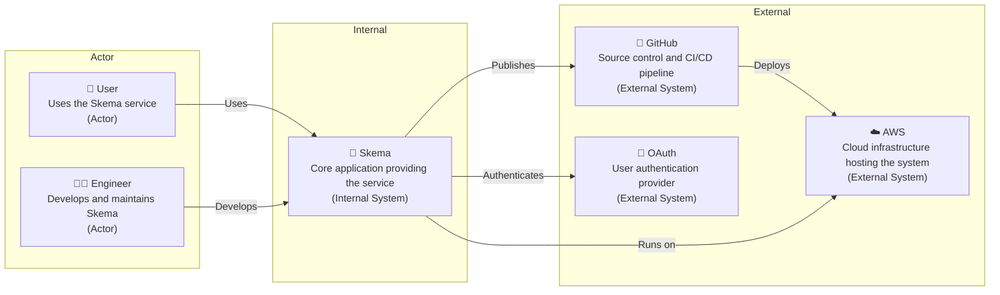
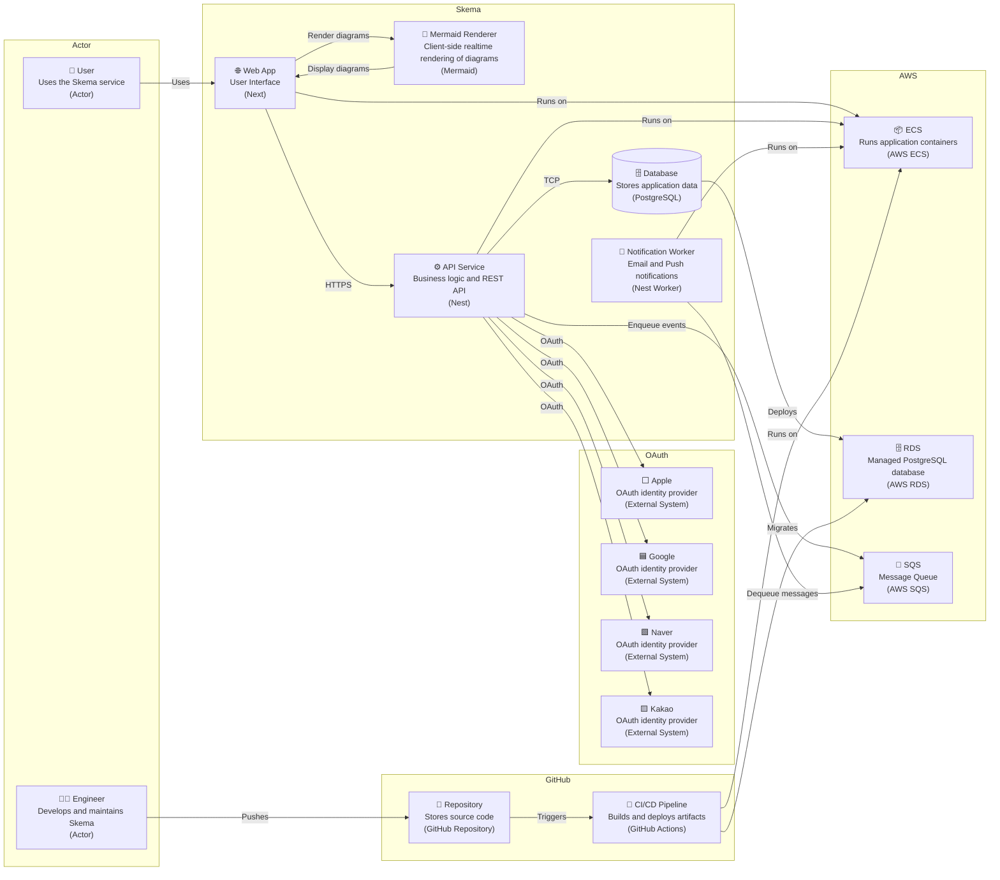
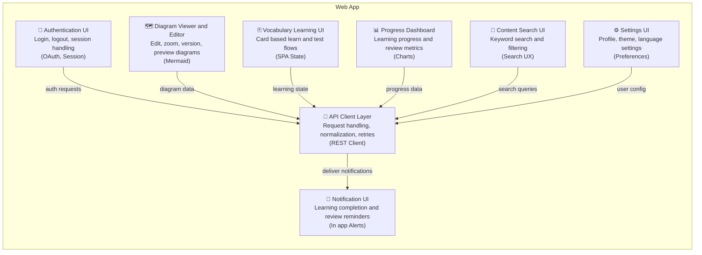
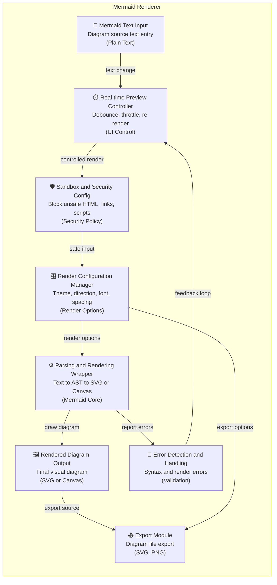
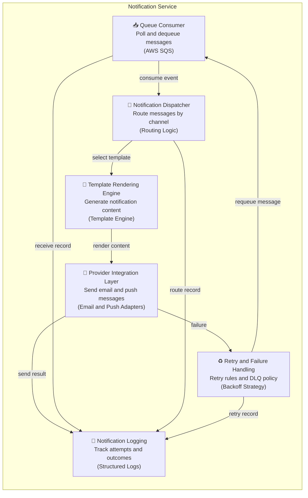
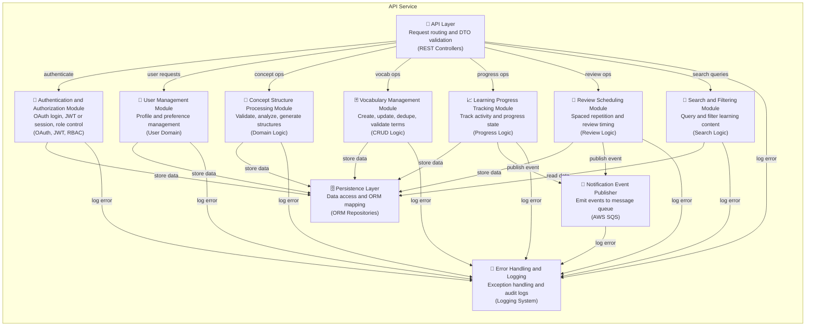
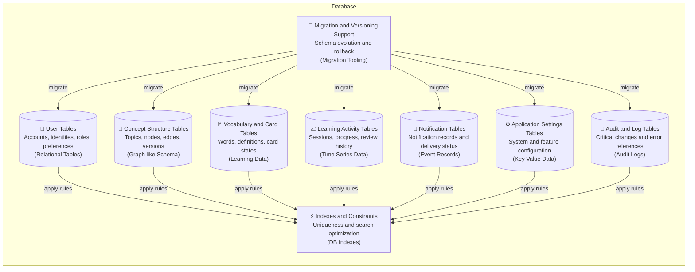

# 시스템 아키텍처

## **1. 시스템 개요**

Skema는 개념 구조와 학습 내용을 시각화하고 반복 학습할 수 있도록 지원하는 학습 도구이다. 사용자는 다이어그램 기반으로 개념을 정리하고, 어휘 카드와 복습 흐름을 통해 학습을 진행한다. 시스템은 웹 애플리케이션과 API 중심 구조로 구성되며, 인증, 데이터 관리, 알림 처리를 명확히 분리하여 확장성과 유지보수성을 고려해 설계되었다.

---

## **2. 기술 스택**

Skema는 프론트엔드와 백엔드를 TypeScript 기반으로 통일하여 개발 생산성과 유지보수성을 높였다. 웹 애플리케이션은 컴포넌트 중심의 UI와 서버 렌더링을 고려해 구성되었으며, 서버는 API 중심 구조로 설계되었다. 배포와 운영은 클라우드 환경에서 자동화된 파이프라인을 통해 관리된다.

| 구성 요소 | 사용 기술 |
| --- | --- |
| 프론트엔드 개발 | TypeScript, React, Next, HTML, CSS |
| 백엔드 개발 | TypeScript, Node, Nest, PostgreSQL |
| 버전 관리 | Unix, Git, GitHub |
| 배포 및 인프라 | AWS ECS, AWS RDS |
| 코드 품질 관리 | Prettier, ESLint, StyleLint |
| 테스트 | Jest, Playwright |
| API 명세 | OpenAPI |
| CI/CD | Github Actions, Docker |

---

## **3. 아키텍처 다이어그램**

### 3.1 컨텍스트 다이어그램

이 다이어그램은 Skema와 사용자, 운영자, 외부 시스템 간의 상호작용 범위를 보여준다. 사용자는 Skema를 통해 서비스를 이용하며, 운영자는 개발과 배포를 담당한다. Skema는 클라우드 인프라 위에서 실행되고, 인증과 배포는 외부 시스템에 의존한다.

### 3.2 컨테이너 다이어그램

이 다이어그램은 Skema를 구성하는 주요 실행 단위와 그 책임 분리를 나타낸다. 사용자 인터페이스, API 처리, 알림 처리는 각각 독립된 서비스로 분리되어 배포된다. 핵심 데이터는 중앙 데이터베이스에 저장되며, 비동기 이벤트는 메시지 큐를 통해 처리된다.

### 3.3 Web App 컴포넌트 다이어그램

이 다이어그램은 웹 애플리케이션 내부의 주요 사용자 인터페이스 구성 요소와 API 연동 구조를 보여준다. 각 UI 컴포넌트는 사용자 기능 단위로 분리되어 있으며, 공통 API 클라이언트를 통해 서버와 통신한다. 알림과 상태 변화는 UI 전반에 공유된다.

### 3.4 Mermaid Renderer 컴포넌트 다이어그램

이 다이어그램은 다이어그램 텍스트가 시각적 결과로 변환되는 내부 처리 흐름을 나타낸다. 입력된 텍스트는 검증과 보안 처리를 거쳐 렌더링되며, 설정에 따라 실시간 미리보기와 내보내기가 수행된다. 오류는 즉시 사용자에게 피드백된다.

### 3.5 Notification Service 컴포넌트 다이어그램

이 다이어그램은 알림 이벤트가 처리되고 전달되는 흐름을 보여준다. 큐에서 수신한 이벤트는 유형에 따라 분기되며, 템플릿을 통해 메시지가 생성된다. 전송 결과는 기록되고, 실패한 경우 재시도 정책에 따라 다시 처리된다.

### 3.6 API Service 컴포넌트 다이어그램

이 다이어그램은 API 서비스 내부의 도메인별 책임 분리와 처리 흐름을 나타낸다. 요청은 인증과 검증을 거쳐 각 도메인 로직으로 전달된다. 데이터는 영속 계층을 통해 관리되며, 학습 진행과 복습과 관련된 이벤트는 외부 알림 시스템으로 발행된다.

### 3.7 Database 컴포넌트 다이어그램

이 다이어그램은 데이터베이스에 저장되는 주요 데이터 영역과 그 구조를 보여준다. 사용자, 학습 콘텐츠, 활동 기록, 알림 정보는 목적에 따라 분리된 테이블로 관리된다. 인덱스와 마이그레이션 구조를 통해 무결성과 확장성을 유지한다.

